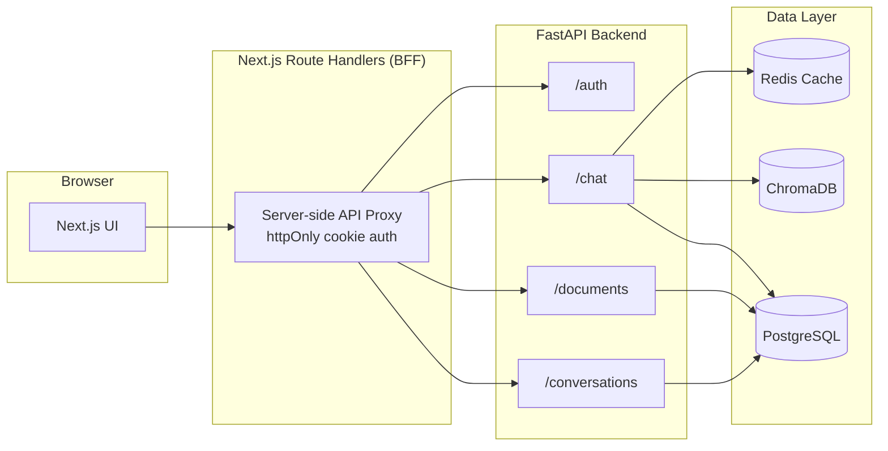
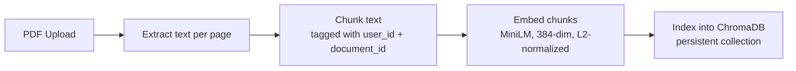
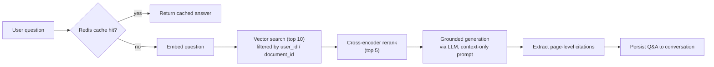

# AskDocs

**Ask questions about your documents and get grounded, page-cited answers.**

AskDocs is a full-stack Retrieval-Augmented Generation (RAG) application. Upload a PDF, ask a question in natural language, and get an answer generated strictly from the document's content — with citations pointing back to the exact page it came from.


---

## Overview

Most chat-with-your-PDF tools either hallucinate answers or return generic summaries with no way to verify where the information came from. AskDocs is built around **grounding and auditability**: every answer is generated only from retrieved document chunks, and every response carries the page number(s) it was derived from.

The system is split into two pipelines — **ingestion** (get a document ready to be searched) and **query** (turn a question into a cited answer) — sitting behind a secure, cookie-based auth layer.

## Architecture



The browser never talks to the backend directly. Next.js Route Handlers act as a **Backend-for-Frontend (BFF)**: the JWT issued at login is stored in an `httpOnly`, `Secure` cookie and attached server-side on every proxied request. This removes the token from client-accessible JavaScript entirely and avoids the need for CORS.

### Ingestion pipeline



Each chunk is tagged with `user_id` and `document_id` at index time, which becomes the tenant-isolation boundary at query time.

### Query pipeline



**Why retrieve → rerank → generate:** vector search alone is fast but imprecise; a cross-encoder reranker re-scores the top candidates against the exact question for much higher relevance before they ever reach the LLM. The generation prompt is explicitly constrained to answer *only* from the retrieved context, and to say so when the answer isn't present — this is what keeps citations meaningful instead of decorative.

## Features

- **Grounded Q&A** — answers are generated only from retrieved document content, with page-level citations attached.
- **Multi-turn conversations** — chat history is persisted per conversation (PostgreSQL) and fed back into the generation prompt for context-aware follow-ups.
- **Document library** — upload, preview, and delete PDFs independently of any conversation.
- **Response caching** — identical questions (per user, per document) are served from Redis within a short TTL, skipping the full retrieval-rerank-generate pipeline.
- **Tenant isolation** — every vector search and database query is scoped by `user_id`, enforced at the retrieval layer, not just the API layer.
- **Secure auth** — JWT issued on login, stored only in an httpOnly cookie, never exposed to client-side JavaScript.

## Tech Stack

| Layer | Technology |
|---|---|
| Frontend | Next.js (App Router), Route Handlers as BFF |
| Backend | FastAPI, Python |
| Relational DB | PostgreSQL (users, documents, conversations, messages) |
| Vector Store | ChromaDB (persistent collection) |
| Cache | Redis (response caching, SHA-256 keyed, TTL-based) |
| Embeddings | `sentence-transformers/all-MiniLM-L6-v2` |
| Reranking | `cross-encoder/ms-marco-MiniLM-L-6-v2` |
| LLM | Groq (`openai/gpt-oss-20b`) |
| Auth | JWT via httpOnly cookies (form-urlencoded login) |

## Getting Started

> Adjust environment variable names and commands below to match your local `.env` and scripts.

```bash
# clone
git clone https://github.com/<your-username>/askdocs.git
cd askdocs

# backend
cd backend
pip install -r requirements.txt
alembic upgrade head
uvicorn main:app --reload

# frontend
cd ../frontend
npm install
npm run dev
```

Required environment variables typically include a Postgres connection string, a Redis URL, a Groq API key, and a JWT signing secret — see `.env.example` in each service.

## Project Structure

```
backend/
  main.py            # FastAPI app, route definitions
  models.py          # SQLAlchemy models (User, Document, Conversation, Message)
  schemas.py         # Pydantic request/response schemas
  ai/
    embeddings.py     # MiniLM embedding generation
    retrieval.py      # Chroma indexing + vector search
    reranker.py       # Cross-encoder reranking
    generation.py     # Prompt construction + grounded generation
    llm_client.py     # Groq client
    cache.py          # Redis response cache
    conversation.py   # Conversation/message persistence
  services/
    pdf_service.py    # PDF text extraction
    chunker.py        # Text chunking

frontend/
  app/
    api/               # Next.js Route Handlers (BFF layer)
    chat/              # Chat UI, sidebar, document library
  lib/
    api.ts             # Typed API client
```

## Roadmap

- [ ] Deploy backend + frontend (currently local-only)
- [ ] Streaming responses (SSE) instead of single-shot JSON replies
- [ ] Cross-document question answering
- [ ] Automated eval suite for citation accuracy at scale

## License

MIT — see [LICENSE](LICENSE) for details.
