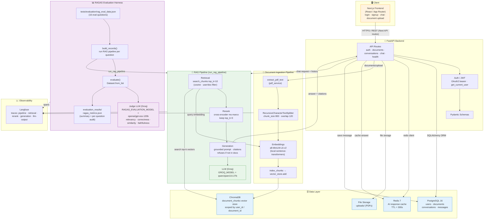
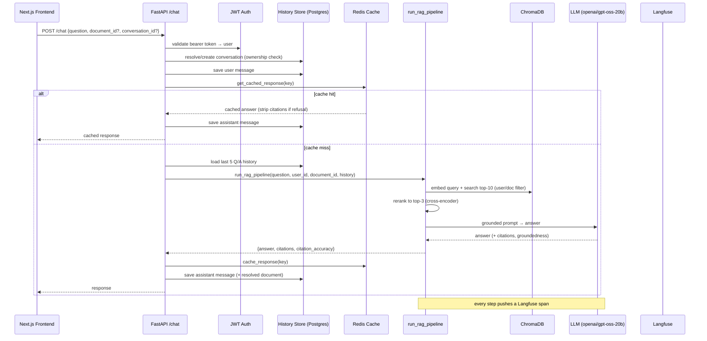
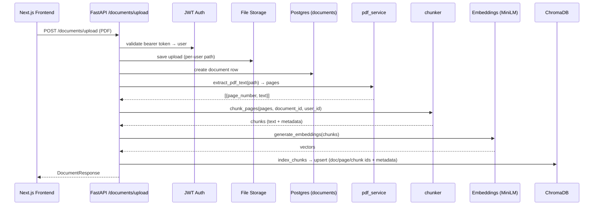
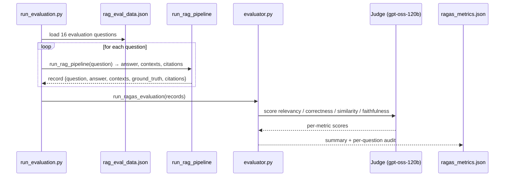

# Architecture

This document describes the architecture of the project: a **multi-tenant Document
RAG (Retrieval-Augmented Generation) application** with a **full-stack** FastAPI +
Next.js codebase and a separate **RAGAS evaluation harness** used to measure answer
quality.

Two models power the system (both served via Groq):

| Model setting | Model | Role |
|---|---|---|
| `GROQ_MODEL` | `openai/gpt-oss-20b` | RAG **generation** — produces the grounded answer |
| `RAGAS_EVALUATION_MODEL` | `openai/gpt-oss-120b` | RAGAS **judge** — scores answers offline |

---

## High-level architecture



---

## Components

### Infrastructure
- **Docker Compose**: three services — `api` (FastAPI), `postgres:16`, `redis:7`.
  The API runs in a container (`Dockerfile`) or locally via `venv`.
- **Configuration**: centralised in `app/core/config.py`, loaded from `.env` /
  `.env.example`.

### Full-stack / software engineering

| Concern | Implementation |
|---|---|
| User management & auth | JWT (OAuth2 bearer via `jose`), password hashing (`pwdlib`), `get_current_user` dependency, per-user row scoping throughout |
| Database | PostgreSQL 16 via SQLAlchemy ORM + Alembic migrations; tables `users`, `documents`, `conversations`, `messages` |
| Data access | Repositories in `app/db/repos/` (`user`, `document`, `conversation`) |
| Caching | Redis — deterministic SHA-256 cache key over `user_id:document_id:question`, TTL 300s, refusal-citation guard |
| Chat history | `messages` rows; the last 5 Q/A pairs injected into the RAG prompt as context |
| API / validation | FastAPI routers + Pydantic schemas (`app/api/routes/`, `app/schemas/`) |
| File storage | PDFs stored under `uploads/`, metadata (path/filename/owner) in PostgreSQL |

### AI / RAG pipeline

| Step | Implementation |
|---|---|
| Ingest | PDF → text (`pdf_service`) → chunks (`RecursiveCharacterTextSplitter`, size 800 / overlap 120) → embeddings (`all-MiniLM-L6-v2`, local) → index into ChromaDB |
| Retrieve | `search_chunks` — top-10, cosine similarity, scoped by `user_id` (and optional `document_id`) |
| Rerank | Cross-encoder (`cross-encoder/ms-marco-MiniLM-L-6-v2`) re-scores and keeps the top-3 chunks |
| Generate | Grounded prompt from retrieved chunks only, returns **citations** (document_id + page_number), refuses when the answer is not in the document; model = `GROQ_MODEL` (qwen/qwen3.6-27b) |
| Trace | Every stage emits a Langfuse span (latency, retrieved pages, citation count, etc.) |

### Evaluation harness (offline)

| Step | Implementation |
|---|---|
| Data | `tests/evaluation/rag_eval_data.json` — eval questions with ground-truth answers |
| Build records | `build_records()` runs the **live** RAG pipeline per question to capture `answer`, `contexts`, and `citations` |
| Score | `evaluate()` converts records to a HuggingFace `Dataset` and runs RAGAS metrics |
| Judge | `openai/gpt-oss-120b` (`RAGAS_EVALUATION_MODEL`) scores: `answer_relevancy`, `answer_correctness`, `answer_similarity`, `faithfulness` |
| Report | `evaluation_results/ragas_metrics.json` — overall summary + per-question audit (question, generated_answer, reference_answer, retrieved_contexts, citations, metrics) |

---

## Request flows (sequence)

### Flow 1 — Chat / question-answering



### Flow 2 — Document upload / indexing



### Flow 3 — Evaluation run



---

## How to run

```bash
# Backend (FastAPI)
uvicorn app.main:app --reload        # or: docker compose up

# Frontend (Next.js)
cd frontend && npm run dev

# Evaluation
cd ~/Projects/AI/ai-app                       # replace with repo root
MAX_EVALUATION_SAMPLES=1 ./venv/bin/python -m app.evaluation.run_evaluation   # smoke
./venv/bin/python -m app.evaluation.run_evaluation                            # full (16)
```

`MAX_EVALUATION_SAMPLES` (0 = all questions) can be overridden from the shell, taking
precedence over the `.env` value.
